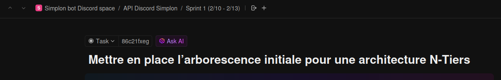

<p align="center">
  <a href="http://nestjs.com/" target="blank"></a>
</p>

[circleci-image]: https://img.shields.io/circleci/build/github/nestjs/nest/master?token=abc123def456
[circleci-url]: https://circleci.com/gh/nestjs/nest

  <p align="center">A progressive <a href="http://nodejs.org" target="_blank">Node.js</a> framework for building efficient and scalable server-side applications.</p>
    <p align="center">
<a href="https://www.npmjs.com/~nestjscore" target="_blank"></a>
<a href="https://www.npmjs.com/~nestjscore" target="_blank"></a>
<a href="https://www.npmjs.com/~nestjscore" target="_blank"></a>
<a href="https://circleci.com/gh/nestjs/nest" target="_blank"></a>
<a href="https://coveralls.io/github/nestjs/nest?branch=master" target="_blank"></a>
<a href="https://discord.gg/G7Qnnhy" target="_blank"></a>
<a href="https://opencollective.com/nest#backer" target="_blank"></a>
<a href="https://opencollective.com/nest#sponsor" target="_blank"></a>
  <a href="https://paypal.me/kamilmysliwiec" target="_blank"></a>
    <a href="https://opencollective.com/nest#sponsor"  target="_blank"></a>
  <a href="https://twitter.com/nestframework" target="_blank"></a>
</p>
  <!--[](https://opencollective.com/nest#backer)
  [](https://opencollective.com/nest#sponsor)-->

## Description

Cette API est conçue pour gérer des bots Discord en utilisant le framework NestJS et Fastify. 

## Sommaire

- [Normes des Commits et Pull Requests](#normes-pour-les-commits-et-les-pull-requests)
- [Installation](#installation)
- [Configuration et Démarrage](#configuration-et-démarrage)
- [Tests](#tests)
- [Déploiement](#déploiement)
- [Ressources](#ressources)
- [API Endpoints](#api-endpoints)
  - [Guild Endpoints](#guild-endpoints)
  - [Campus Endpoints](#campus-endpoints)
  - [Channel Endpoints](#channel-endpoints)
  - [Promotion Endpoints](#promotion-endpoints)
  - [Roles Endpoints](#roles-endpoints)
  - [Messages Endpoints](#messages-endpoints)
  - [Answers Endpoints](#answers-endpoints)
  - [Comments Endpoints](#comments-endpoints)
  - [Courses Endpoints](#courses-endpoints)
  - [Dashboard Accounts Endpoints](#dashboard-accounts-endpoints)
  - [Discord Users Endpoints](#discord-users-endpoints)
  - [Members Endpoints](#members-endpoints)
  - [Resources Endpoints](#resources-endpoints)
  - [Reports Endpoints](#reports-endpoints)
  - [Questions Endpoints](#questions-endpoints)
  - [Votes Endpoints](#votes-endpoints)
  - [XP Transactions Endpoints](#xp-transactions-endpoints)
  - [Guilds-Templates Endpoints](#guilds-templates-endpoints)
  - [Categories Endpoints](#categories-endpoints)
  - [Identification Requests Endpoints](#identification-requests-endpoints)
  - [Members Informations Endpoints](#members-informations-endpoints)
  - [Moderator Actions Endpoints](#moderator-actions-endpoints)
  - [Tags](#tags)


# Normes pour les commits et les pull requests ✍️

Afin de maintenir une cohérence et une clarté dans notre travail collaboratif, nous avons mis en place des normes pour les messages de commit et les pull requests.

## Utilisation de GitFlow

Le projet suit le workflow GitFlow pour la gestion des branches. Voici les principales branches à utiliser :

- `main` : Branche de production, contient le code stable
- `develop` : Branche principale de développement
- `feature/*` : Branches pour les nouvelles fonctionnalités
- `hotfix/*` : Branches pour les corrections urgentes
- `release/*` : Branches pour la préparation des versions

Règles importantes :
- Toute nouvelle fonctionnalité doit partir de `develop` et créer une branche `feature/nom-de-la-feature`
- Les corrections urgentes partent de `main` avec une branche `hotfix/nom-du-fix`
- Les branches `feature` sont fusionnées dans `develop`
- Les `hotfix` sont fusionnés dans `main` ET `develop`

## Messages de commit

Les messages de commit doivent suivre ce format :

    type(portée): titre du commit

### Explication :

**_type_** : Le type de modification, par exemple "fix" ou "feat".

**_portée_** : Le dossier concerné (un commit par fichier modifié, supprimé ou ajouté). La portée à indiquer sera l'identifiant de la tâche associée au ticket, par exemple noter 86c21fxeg pour la tâche suivante: \


**_titre du commit_**: Une description concise du changement apporté. En l'occurence  (en anglais)

### Exemple :

```
  feat(controller): add problem endpoints
```

## Body du commit (corps détaillé)

**_Ajouter un body_** : Si le titre du commit n'est pas assez explicite sur la localisation de la modification, le nom du fichier doit être précisé dans le body.

### Exemple :

```
In file "problem.controller.ts" 
```

Cela permet de donner plus d'informations sur les raisons du changement, son impact ou les fichiers modifiés.

## Longueur des commits

**_Bonne pratique_** : Respecter une longueur maximale d'environ 50 caractères pour les titres des commits. Cela permet d'avoir des messages concis, faciles à lire et à comprendre.

## Commits atomiques

**_Commits atomiques_** : Chaque commit doit être atomique, c'est-à-dire qu'il doit se concentrer sur une seule fonctionnalité ou un seul changement.
Cela veut dire un commit par fichier modifié, supprimé ou ajouté au minimum.

Cela garantit une meilleure traçabilité et simplifie la gestion des erreurs.

## Noms des pull requests

**_Nom en anglais_** : Les titres des pull requests doivent être rédigés en anglais pour garantir une compréhension globale de l'équipe.

## Labels sur les pull requests

**_Ajout de labels_** : Chaque pull request doit inclure un ou plusieurs labels pour faciliter la gestion des PRs.

Les labels indiquent le type de changement.

Par exemple :


## Noms de fichiers

**_Nom des fichiers en français_** : Les noms des fichiers dans le projet doivent être en français pour garder une cohérence avec la langue principale du projet.

Utiliser le **kebab-case** : Les noms de fichiers doivent être écrits en kebab-case, c'est-à-dire tout en minuscules, avec des mots séparés par des tirets.

**_Exemple_** :

    gestion-utilisateurs.js
    verifier-email.md

## Suivi des changements dans les pull requests

**_Demandes de changements détaillées par les reviewers_** : Si un reviewer exige des modifications sur une pull request, il doit clairement spécifier dans un commentaire les changements à effectuer.

Le reviewer doit fournir une explication détaillée pour s'assurer que le contributeur comprend bien les modifications demandées. Cela favorise la transparence et permet à tous les membres de l'équipe de suivre l'évolution de la pull request.

## Processus d'approbation et de fusion des pull requests

**_Approbation partagée_** : Une pull request doit être validée par au moins un membre du groupe émetteur de la PR en question.

**_Nombre minimum de reviewers_** : Pour qu'une pull request soit fusionnée, elle doit être approuvée par un minimum de trois reviewers, y compris des membres externes au groupe émetteur, afin de garantir une évaluation complète et de qualité.

**_Validation du Tech Lead_** : Parmi les reviewers, le Tech Lead du groupe émetteur de la pull request doit obligatoirement faire partie des approbateurs. L'approbation finale du Tech Lead est nécessaire pour qu'un membre du groupe puisse procéder à la fusion. Il revient au Tech Lead de donner l'aval définitif, assurant que la pull request est prête à être intégrée dans la base de code principale.

**_Responsabilité lors de la fusion_** : Le tech lead qui approuve le merge d'une pull request est responsable de la fusion de celle-ci. En acceptant de fusionner la pull request, il accepte également de prendre la responsabilité en cas de problèmes futurs liés à cette pull request.

**_Interdiction pour l'émetteur de fusionner sa pull request_** : L'émetteur de la pull request n'est pas autorisé à fusionner sa propre pull request. Cela permet de garantir une validation externe par les autres membres du groupe ou par des reviewers indépendants, pour renforcer la qualité et la fiabilité des modifications apportées.

**_Annulation des approbations de pull requests lorsque de nouveaux commits sont poussés_** : La règle "Dismiss stale pull request approvals when new commits are pushed" doit être activée. Cela signifie que si des commits supplémentaires sont ajoutés à une pull request déjà approuvée, les approbations précédentes seront automatiquement révoquées. Cette règle garantit que les modifications récentes sont également examinées par les reviewers, assurant ainsi que l'évaluation de la pull request reste valide et à jour.

## Installation

```bash
$ npm install
```

## Configuration et Démarrage

```bash
# développement
$ npm run start

# mode watch
$ npm run start:dev

# mode production
$ npm run start:prod
```

## Tests

```bash
# tests unitaires
$ npm run test

# tests e2e
$ npm run test:e2e

# couverture de tests
$ npm run test:cov
```

## Contributeurs

- [aReynier](https://github.com/aReynier)
- [AyoubLaroussi](https://github.com/ayoub-laroussi)
- [Boris betremieux](https://github.com/BborisB )
- [Martial Floquet](https://github.com/martial59110)
- [EnguerranSGG](https://github.com/EnguerranSGG)
- [Gabriel Luthun](https://github.com/gabrielluthun)
- [Julien Beauchant](https://github.com/julienbeauchant)
- [Messa](https://github.com/MessaKami)
- [YohanF1245](https://github.com/YohanF1245)
- [Justin Didelot](https://github.com/Srekaens)
- [Abdel](https://github.com/UnknOownU)

## API Endpoints

### Guild Endpoints

#### Create a Guild
- **POST** `/guild`
```json
{
  "uuid": "123456789012345678",
  "name": "My Discord Server",
  "memberCount": 100,
  "configuration": {
    "welcomeChannel": "123456789",
    "prefix": "!",
    "language": "fr"
  }
}
```

#### Get All Guilds
- **GET** `/guild`

#### Get One Guild
- **GET** `/guild/:uuid`
Example: `/guild/123456789012345678`

#### Update a Guild
- **PUT** `/guild/:uuid`
```json
{
  "uuid": "123456789012345678",
  "name": "Updated Server Name",
  "memberCount": 150,
  "configuration": {
    "welcomeChannel": "987654321",
    "prefix": "?",
    "language": "en"
  }
}
```

#### Delete a Guild
- **DELETE** `/guild/:uuid`
Example: `/guild/123456789012345678`

### Campus Endpoints

#### Create a Campus
- **POST** `/campus`
```json
{
  "name": "Valenciennes"
}
```

#### Get All Campuses
- **GET** `/campus`

#### Get One Campus
- **GET** `/campus/:uuid`
Example: `/campus/550e8400-e29b-41d4-a716-446655440000`

#### Update a Campus
- **PUT** `/campus/:uuid`
```json
{
  "name": "Lille"
}
```

#### Delete a Campus
- **DELETE** `/campus/:uuid`
Example: `/campus/550e8400-e29b-41d4-a716-446655440000`

### Guilds-Templates Endpoints

#### Create a Guild Template
- **POST** `/guilds-templates`
```json
{
  "uuid": "123456789012345678",
  "name": "Server Template",
}
```

#### Get All Guild Templates
- **GET** `/guilds-templates`

#### Get One Guild Template
- **GET** `/guilds-templates/:uuid`
Example: `/guilds-templates/123456789012345678`

#### Update a Guild Template
- **PUT** `/guilds-templates/:uuid`
```json
{
  "name": "Updated Template Name",
}
```

#### Delete a Guild Template
- **DELETE** `/guilds-templates/:uuid`
Example: `/guilds-templates/123456789012345678`

### Channel Endpoints

#### Create a Channel
- **POST** `/channels`
```json
{
  "name": "general",
  "type": "text",
  "channelPosition": 1
}
```

#### Get All Channels
- **GET** `/channels`

#### Get One Channel
- **GET** `/channels/:uuid`
Example: `/channels/123456789012345678`

#### Update a Channel
- **PUT** `/channels/:uuid`
```json
{
  "name": "announcements",
  "type": "text",
  "channelPosition": 2
}
```

#### Delete a Channel
- **DELETE** `/channels/:uuid`
Example: `/channels/123456789012345678`

### Promotion Endpoints

#### Create a Promotion
- **POST** `/promotions`
```json
{
  "name": "Dev Web 2024",
  "startDate": "2024-01-01T00:00:00.000Z",
  "endDate": "2024-12-31T23:59:59.999Z"
}
```

#### Get All Promotions
- **GET** `/promotions`

#### Get One Promotion
- **GET** `/promotions/:uuid`
Example: `/promotions/550e8400-e29b-41d4-a716-446655440000`

#### Update a Promotion
- **PUT** `/promotions/:uuid`
```json
{
  "name": "Dev Web 2024 - Updated",
  "startDate": "2024-02-01T00:00:00.000Z",
  "endDate": "2024-12-31T23:59:59.999Z"
}
```

#### Delete a Promotion
- **DELETE** `/promotions/:uuid`
Example: `/promotions/550e8400-e29b-41d4-a716-446655440000`

Note: 
- All timestamps (`createdAt`, `updatedAt`) are managed automatically
- For Guild endpoints, the `uuid` must be a valid Discord server ID (17-20 digits)
- For Campus endpoints, the `uuid` is automatically generated

### Roles Endpoints

#### Create a Role
- **POST** `/roles`
```json
{
  "uuid": "123456789012345678",
  "name": "Administrateur",
  "color": "#FF0000",
  "permissions": ["MANAGE_CHANNELS", "MANAGE_ROLES"],
  "position": 1,
  "uuid_guild": "987654321098765432"
}
```

#### Get All Roles
- **GET** `/roles`

#### Get One Role
- **GET** `/roles/:uuid`
Example: `/roles/123456789012345678`

#### Update a Role
- **PUT** `/roles/:uuid`
```json
{
  "name": "Super Admin",
  "color": "#0000FF",
  "permissions": ["ADMINISTRATOR"],
  "position": 2
}
```

#### Delete a Role
- **DELETE** `/roles/:uuid`
Example: `/roles/123456789012345678`


### Identification Requests Endpoints

#### Create identification request

- **POST** `/identification-requests`
```json
{
  "uuidMember": "57bb2c9b-a472-408d-9b90-4a834da929d0",
  "firstname": "Hidetaka",
  "lastname": "Miyazaki",
  "email": "hidetaka.miyazaki@from-software.com"
}
```

#### Get All identification requests 
- **GET** `/identification-requests`

#### Get One identification request
- **GET** `/identification-requests/:uuid`  
Example: `/identification-requests/57bb2c9b-a472-408d-9b90-4a834da929d0`

#### Update identification request
- **PUT** `/identification-requests/:uuid`
```json
{
  "uuidMember": "57bb2c9b-a472-408d-9b90-4a834da929d0",
  "firstname": "Hidetaka",
  "lastname": "Miyazaki",
  "email": "hidetaka.miyazaki@from-software.jp"
}
```

#### Delete identification request
- **DELETE** `/identification-requests/:uuid`  
Example: `/identification-requests/57bb2c9b-a472-408d-9b90-4a834da929d0`

### Members Informations Endpoints

#### Create member informations

- **POST** `/members-informations`
```json
{
  "uuid-member": "123456789012345678",
  "firstname": "Hidetaka",
  "lastname": "Miyazaki",
  "email": "hidetaka.miyazaki@from-software.com"
}
```

#### Get All members informations 
- **GET** `/members-informations`

#### Get One member informations
- **GET** `/members-informations/:uuid`
Example: `/members-informations/57bb2c9b-a472-408d-9b90-4a834da929d0`


#### Update member informations
- **PUT** `/members-informations/:uuid`
```json
{
  "uuid-member": "123456789012345678",
  "firstname": "Hidetaka",
  "lastname": "Miyazaki",
  "email": "hidetaka.miyazaki@from-software.jp"
}
```

#### Delete member informations

- **DELETE** `/members-informations/:uuid`
Example: `/members-informations/57bb2c9b-a472-408d-9b90-4a834da929d0`

### Categories Endpoints

#### Create category

- **POST** `/categories`
```json
{
  "uuid": "123456789012345678",
  "uuidGuild": "987654321098765432",
  "name": "General",
  "position": 1
}
```

#### Get All categories 
- **GET** `/categories`

#### Get One category
- **GET** `/categories/:uuid`  
Example: `/categories/57bb2c9b-a472-408d-9b90-4a834da929d0`

#### Update category
- **PUT** `/categories/:uuid`
```json
{
  "uuid": "123456789012345678",
  "uuidGuild": "987654321098765432",
  "name": "Updated Category",
  "position": 2
}
```

#### Delete category
- **DELETE** `/categories/:uuid`  
Example: `/categories/57bb2c9b-a472-408d-9b90-4a834da929d0`

Note: 
- All timestamps (`createdAt`, `updatedAt`) are managed automatically
- For Guild endpoints, the `uuid` must be a valid Discord server ID (17-20 digits)
- For Campus endpoints, the `uuid` is automatically generated

### Answers Endpoints

#### Create an Answer
- **POST** `/answers`
```json
{
  "content": "Paris",
  "isMultipleAnswer": false,
  "questionUuid": "123e4567-e89b-12d3-a456-426614174000"
}
```

#### Get All Answers
- **GET** `/answers`

#### Get One Answer
- **GET** `/answers/:uuid`
Example: `/answers/123e4567-e89b-12d3-a456-426614174000`

#### Update an Answer
- **PUT** `/answers/:uuid`
```json
{
  "content": "Updated answer",
  "isMultipleAnswer": true
}
```

#### Delete an Answer
- **DELETE** `/answers/:uuid`
Example: `/answers/123e4567-e89b-12d3-a456-426614174000`

### Comments Endpoints

#### Create a Comment
- **POST** `/comments`
```json
{
  "content": "Très bon travail sur ce projet !",
  "comment_status": "active",
  "uuid_member": "123e4567-e89b-12d3-a456-426614174000",
  "resource_uuid": "123e4567-e89b-12d3-a456-426614174000",
  "user_uuid": "123e4567-e89b-12d3-a456-426614174000"
}
```

#### Get All Comments
- **GET** `/comments`

#### Get One Comment
- **GET** `/comments/:uuid`
Example: `/comments/123e4567-e89b-12d3-a456-426614174000`

#### Update a Comment
- **PATCH** `/comments/:uuid`
```json
{
  "content": "Contenu mis à jour",
  "comment_status": "inactive"
}
```

#### Delete a Comment
- **DELETE** `/comments/:uuid`
Example: `/comments/123e4567-e89b-12d3-a456-426614174000`

### Courses Endpoints

#### Create a Course
- **POST** `/courses`
```json
{
  "name": "cda-vals-p4",
  "isCertified": true,
  "uuidGuild": "123456789012345678",
  "uuidCategory": "123456789012345678"
}
```

#### Get All Courses
- **GET** `/courses`

#### Get One Course
- **GET** `/courses/:uuid`
Example: `/courses/123e4567-e89b-12d3-a456-426614174000`

#### Update a Course
- **PUT** `/courses/:uuid`
```json
{
  "name": "updated-course",
  "isCertified": false
}
```

#### Delete a Course
- **DELETE** `/courses/:uuid`
Example: `/courses/123e4567-e89b-12d3-a456-426614174000`

### Dashboard Accounts Endpoints

#### Create a Dashboard Account
- **POST** `/dashboardAccounts`
```json
{
  "email": "test@example.com",
  "password": "password123",
  "uuid_discord": "123456789012345678"
}
```

#### Get One Dashboard Account
- **GET** `/dashboardAccounts/:uuid_dashboard_account`
Example: `/dashboardAccounts/123e4567-e89b-12d3-a456-426614174000`

#### Update a Dashboard Account
- **PUT** `/dashboardAccounts/:uuid_dashboard_account`
```json
{
  "email": "updated@example.com",
  "password": "newpassword123"
}
```

#### Delete a Dashboard Account
- **DELETE** `/dashboardAccounts/:uuid_dashboard_account`
Example: `/dashboardAccounts/123e4567-e89b-12d3-a456-426614174000`

### Discord Users Endpoints

#### Create a Discord User
- **POST** `/discord-users`
```json
{
  "uuid_discord": "123456789012345678",
  "discordUsername": "JohnDoe#1234",
  "discriminator": "1234"
}
```

#### Get All Discord Users
- **GET** `/discord-users`

#### Get One Discord User
- **GET** `/discord-users/:uuid_discord`
Example: `/discord-users/123456789012345678`

#### Update a Discord User
- **PUT** `/discord-users/:uuid_discord`
```json
{
  "discordUsername": "UpdatedJohnDoe#1234",
  "discriminator": "4321"
}
```

#### Delete a Discord User
- **DELETE** `/discord-users/:uuid_discord`
Example: `/discord-users/123456789012345678`

### Members Endpoints

#### Create a Member
- **POST** `/members`
```json
{
  "guild_username": "JohnDoe",
  "xp": "100.00",
  "level": 1,
  "community_role": "Member",
  "status": "Active",
  "uuid_guild": "123456789012345678",
  "uuid_discord": "123456789012345678"
}
```

#### Get All Members
- **GET** `/members`

#### Get One Member
- **GET** `/members/:uuid`
Example: `/members/123e4567-e89b-12d3-a456-426614174000`

#### Update a Member
- **PATCH** `/members/:uuid`
```json
{
  "guild_username": "UpdatedUser",
  "status": "Inactive",
  "level": 2,
  "xp": "200.00",
  "community_role": "Moderator"
}
```

#### Delete a Member
- **DELETE** `/members/:uuid`
Example: `/members/123e4567-e89b-12d3-a456-426614174000`

### Resources Endpoints

#### Create a Resource
- **POST** `/resources`
```json
{
  "title": "Guide de démarrage",
  "description": "Un guide complet pour démarrer avec le bot",
  "content": "Voici les étapes pour configurer le bot...",
  "status": "active",
  "uuid_member": "123e4567-e89b-12d3-a456-426614174000"
}
```

#### Get All Resources
- **GET** `/resources`

#### Get One Resource
- **GET** `/resources/:uuid`
Example: `/resources/123e4567-e89b-12d3-a456-426614174000`

#### Update a Resource
- **PATCH** `/resources/:uuid`
```json
{
  "title": "Guide de démarrage mis à jour",
  "description": "Guide mis à jour avec les nouvelles fonctionnalités",
  "content": "Nouvelles étapes de configuration...",
  "status": "inactive"
}
```

#### Delete a Resource
- **DELETE** `/resources/:uuid`
Example: `/resources/123e4567-e89b-12d3-a456-426614174000`

### Reports Endpoints

#### Create a Report
- **POST** `/reports`
```json
{
  "type": "resource",
  "category": "inappropriate",
  "reason": "Contenu offensant envers la communauté",
  "uuid_resource": "123e4567-e89b-12d3-a456-426614174000",
  "uuid_reporter": "323b07a1-7cea-4916-82a5-76ff201fa0e2"
}
```

#### Get All Reports
- **GET** `/reports`

#### Get One Report
- **GET** `/reports/:uuid_report`
Example: `/reports/123e4567-e89b-12d3-a456-426614174000`

#### Update a Report
- **PATCH** `/reports/:uuid_report`
```json
{
  "status": "resolved",
  "reason": "Contenu mis à jour"
}
```
Note: Seuls les modérateurs peuvent mettre à jour les signalements.

#### Delete a Report
- **DELETE** `/reports/:uuid_report`
Example: `/reports/123e4567-e89b-12d3-a456-426614174000`
Note: Un utilisateur ne peut supprimer que ses propres signalements.

### Questions Endpoints

#### Create a Question
- **POST** `/questions`
```json
{
  "content": "Quelle est la capitale de la France ?",
  "isMultipleAnswer": false,
  "uuidPoll": "123e4567-e89b-12d3-a456-426614174000"
}
```

#### Get All Questions
- **GET** `/questions`

#### Get One Question
- **GET** `/questions/:uuid`
Example: `/questions/123e4567-e89b-12d3-a456-426614174000`

#### Update a Question
- **PUT** `/questions/:uuid`
```json
{
  "content": "Quelle est la capitale de l'Italie ?",
  "isMultipleAnswer": true
}
```

#### Delete a Question
- **DELETE** `/questions/:uuid`
Example: `/questions/123e4567-e89b-12d3-a456-426614174000`

### Votes Endpoints

#### Create a Vote
- **POST** `/votes`
```json
{
  "userId": "123e4567-e89b-12d3-a456-426614174000",
  "itemId": "123e4567-e89b-12d3-a456-426614174000",
  "voteType": "upvote"
}
```

#### Get All Votes
- **GET** `/votes`

#### Get One Vote
- **GET** `/votes/:id`
Example: `/votes/123e4567-e89b-12d3-a456-426614174000`

#### Update a Vote
- **PUT** `/votes/:id`
```json
{
  "voteType": "downvote",
  "voteIsActive": true
}
```

#### Delete a Vote
- **DELETE** `/votes/:id`
Example: `/votes/123e4567-e89b-12d3-a456-426614174000`

### XP Transactions Endpoints

#### Create an XP Transaction
- **POST** `/xp-transactions`
```json
{
  "transaction_type": "GAIN",
  "source": "VOTE",
  "transaction_value": "100.00",
  "reason": "Vote positif sur une ressource",
  "notes": "Ressource particulièrement utile",
  "reference_type": "RESOURCE",
  "reference_uuid": "123e4567-e89b-12d3-a456-426614174000",
  "uuid_member": "123e4567-e89b-12d3-a456-426614174000"
}
```

#### Get All XP Transactions
- **GET** `/xp-transactions`

#### Get Member's XP Transactions
- **GET** `/xp-transactions/member/:uuid_member`
Example: `/xp-transactions/member/123e4567-e89b-12d3-a456-426614174000`

#### Get One XP Transaction
- **GET** `/xp-transactions/:uuid`
Example: `/xp-transactions/123e4567-e89b-12d3-a456-426614174000`

Note: Les transactions XP ne peuvent pas être modifiées ou supprimées une fois créées pour maintenir l'intégrité des données.

### Moderator Actions Endpoints

#### Créer une action de modération
- **POST** `/moderator-actions`
- **Corps de la requête** :
```json
{
  "userId": "123e4567-e89b-12d3-a456-426614174001",
  "actionType": "ban",
  "reason": "Violation des règles de la communauté",
  "duration": "24h",
  "notes": "Récidive après deux avertissements"
}
```

#### Récupérer toutes les actions de modération
- **GET** `/moderator-actions`

#### Récupérer une action de modération
- **GET** `/moderator-actions/:id`
- **Exemple** : `/moderator-actions/123e4567-e89b-12d3-a456-426614174000`

#### Mettre à jour une action de modération
- **PUT** `/moderator-actions/:id`
- **Corps de la requête** :
```json
{
  "reason": "Mise à jour de la raison",
  "notes": "Notes additionnelles"
}
```

#### Supprimer une action de modération
- **DELETE** `/moderator-actions/:id`
- **Exemple** : `/moderator-actions/123e4567-e89b-12d3-a456-426614174000`

### Tags

#### Créer un tag
- **POST** `/tags`
- **Corps de la requête** :
```json
{
  "name": "JavaScript",
  "description": "Langage de programmation pour le web"
}
```

#### Récupérer tous les tags
- **GET** `/tags`

#### Récupérer un tag
- **GET** `/tags/:id`
- **Exemple** : `/tags/550e8400-e29b-41d4-a716-446655440000`

#### Mettre à jour un tag
- **PATCH** `/tags/:id`
- **Corps de la requête** :
```json
{
  "name": "JavaScript ES2022",
  "description": "Dernière version du langage JavaScript"
}
```

#### Supprimer un tag
- **DELETE** `/tags/:id`
- **Exemple** : `/tags/550e8400-e29b-41d4-a716-446655440000`


